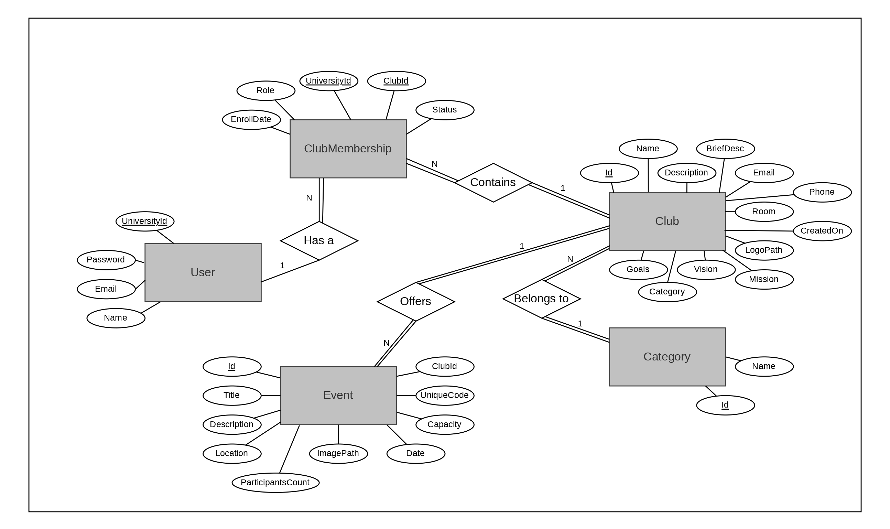

# University Clubs System (UniClubs)

## Project Description
UniClubs is a web application that helps university students explore clubs and participate in events in their university.
Students can discover clubs, learn about their vision, mission, and goals, and join events organized by different clubs.

## Built With
- Visual Studio
- ASP.NET MVC 5
- HTML, CSS, JS, C#
- Entity Framework
- SQL Server LocalDB (.mdf file is included inside App_Data folder)

## Features
### Club Exploration
- View all university clubs
- Search clubs by name or category
- Read each club's:
  - Description
  - Vision
  - Mission
  - Goals
  - Contact information
  - Club room (office)

### Events System
- View all upcoming events
- Search events by club name
- View events that are already full
- View latest events
- Each event includes:
  - Description
  - Date
  - Location
  - Capacity
  - Remaining spots

### Authentication
- Login system

### Roles
- Admin
- Student

### Admin Features
- Create, edit, and delete clubs & events

### Support 
- Users can contact support to send suggestions or report issues

## Database Structure
The project contains 5 tables in the database:
 - User
 - Club
 - Event
 - Category
 - ClubMembership
   
An ER diagram is included for better understanding

## ER Diagram

## Screenshots
This repository includes screenshots of the UniClubs web application.

## How to Run the Project
1. Download or clone the repository.
2. Make sure the UniversityClubs folder and the UniversityClubs.sln file are in the same directory.
3. Open UniversityClubs.sln file using Visual Studio.
4. Click Run.

## Authors
- [Ibrahim Rajou](https://github.com/IbrahimRajou)
- [Mahmoud Youssuf](https://github.com/MahmoudYoussuf)
